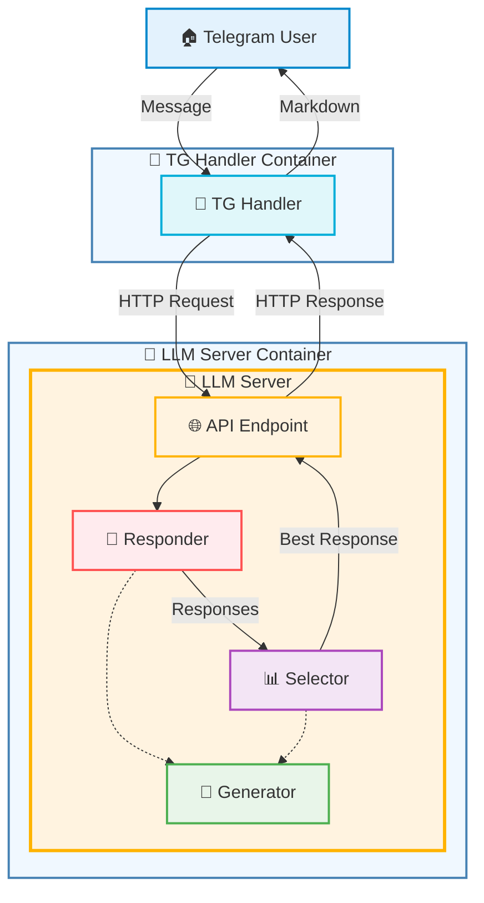

# TG-LLM-MultiBot 🚀

Advanced Framework for Multi-Bot LLM Orchestration in Telegram.

## ✨ Key Features:
- **Multi-Bot Management**: Concurrently handle multiple Telegram bots
- **Chain-of-Thought**: Batch process parallel thought chains with dynamically configurable steps
- **Selection**: Batch rate response canditates for quality-based selection (default: 7 responses → 1 optimal)
- **Production-Grade Stack**: Dockerized microservices with Go's concurrency and Python's ML ecosystem

## 🏗 Architecture
### 📊 Component Flow


### Core Components
| Component               | Description                                       | Key Features                          |
|-------------------------|---------------------------------------------------|---------------------------------------|
| 🐹 **TG Handler** (Go)  | Telegram Bot API interface manager                | • Webhook configuration & validation<br>• PostgreSQL message persistence<br>• Dialog context routing via REST API |
| 🐍 **LLM Server** (Python/FastAPI) | Central generative AI endpoint service | • OpenAI-inspired `/v1/generate` endpoint<br>• HuggingFace & safetensors support<br>• Dynamic batching with:<br> - 2k-32k token windows<br> - Priority queuing<br> - Stream chunk handling |
| **PROCESSING PIPELINE** |                                                   |                                       |
| 🧬 **Generator**        | Base text generation component                    | • Model abstraction layer<br>• Sampling controls:<br> - Temperature (0.1-2.0)<br> - Top-p/top-k filtering<br> - Repetition penalty |
| 🔄 **Responder**        | Response variation engine                         | • Chain-of-Thought prompting<br>• Parallel generation of:<br> - 3-5 response variants<br> - Alternative phrasings<br> - Safety-filtered outputs |
| 📊 **Selector**         | Quality assurance layer                           | • Neural ranking with:<br> - Custom reward models<br> - Perplexity scoring<br> - Semantic similarity<br>• Returns optimized final response |

## ⚙️ Configuration Guide
### Config Hierarchy
    confs/
    ├── init.json                         # Global settings
    └── bots/
        ├── assistant_bot.conf            # General config
        └── assistant_bot_translate.conf  # Command-specific override

### confs/init.json
```json
{
    "keysAPI": [
        "bot1_API_KEY",
        "bot2_API_KEY"
    ],
    "admins": ["admin1_id", "admin2_id"],
    "orders": {
        "translate_bot": ["/translate"]
    },
    "config_path": "./confs/bots",
    "history_path": "./history.json",
    "memory_limit": 5
}
```

| Field         | Description                              |
|---------------|:----------------------------------------:|
| keysAPI       | Telegram bot secret keys                 |
| admins        | Allowed private messengers               |
| orders        | Commands for specific bots               |
| memory_limit  | Number of messages retained for context  |

* Every order implies existance of command specific config.
* When bot receives message with command it searches for postfixed config.
* When bot receives message without command it falls back to its main config.
For example: `translate_bot.conf` + `/translate` -> `translate_bot_translate.conf`

### confs/bots/\<your-bot-name\>(\_\<custom_command\>).json
```json
{
    "system_prompt": "You are a helpful assistant in %s.",

    "think_prompts": [
        "Analyze the dialog:\n%s\n\nAnalysis: ",
        "Respond based on analysis:\nDialog:\n%s\n\nAnalysis:\n%s\n\nResponse:"
    ],
    "rate_prompt": "Rate response (1-10):\n%s\nRating:",
    "temperature": 0.7,
    "response_tokens": 200,
    "response_token_shift": 0,
    "response_batch_size": 7,
    "rate_tokens": 5
    "rate_batch_size": 5
}
```

| Main Parameters      | Function                               |
|----------------------|:--------------------------------------:|
| chain_prompts        | Chain-of-Thought processing stages     |
| response_tokens      | Response number of tokens              |
| response_token_shift | Dynamic token shift from length        |
| response_batch_size  | Number of response variants generated  |
| rate_tokens          | Rate number of tokens                  |
| rate_batch_size      | Number of quality checks per response  |

* System prompt can have %s for chat name.
* Every next think prompt should have +1 %s for full context.
* Variable resp_token_shift shifts input size only when resp_tokens is 0.

## 🐳 Quick Start with Docker
### Clone Repository
```bash
git clone https://github.com/vadimfedulov035/tg-llm-multibot.git
cd tg-llm-multibot
```
### Set Mountpoints
```bash
sudo mkdir /etc/tg-llm-multibot
sudo cp -r confs /etc/tg-llm-multibot/confs  # See Configuration Guide
sudo cp -r <path-to-your-safetensors-model> /etc/tg-llm-multibot/model  # + config.json
```
### Start Containers
```bash
sudo apt install docker-ce docker compose -y  # Install Docker (add official repo)
sudo docker compose up -d  # Start the containers
```
### Manage Containers
```bash
sudo docker compose logs -f --tail 25  # Follow last 25 log lines
sudo docker compose down  # Stop the containers
```

## 🛠️ Manual Installation
### LLM Server Setup
```bash
sudo apt install python3-dev python3-venv -y  # Install Python fully
cd llm-server
cp -r ../safetensors-model .  # Replicate container inner structure
python3 -m venv venv  # Make virtual environment
source ./venv/bin/activate   # Enter into virtual environment
pip install -r requirements.txt  # Install all required packages
uvicorn app:app --reload  # Start FastAPI service
deactivate  # Exit from virtual environment
```

### Telegram Handler Setup
```bash
sudo apt install golang -y  # Install Golang
cd tg-handler
cp ../confs .  # Replicate container inner structure
sed -i 's/llm-server/127.0.0.1/g' api/api.go  # Reset local endpoint to localhost
go build -ldflags="-s -w" -tags lambda.norpc main.go  # Compile production ready
./main  # Run Telegram Handler
```

## 🤝 Contributing

Fork repository

Create feature branch

Submit PR with detailed description
